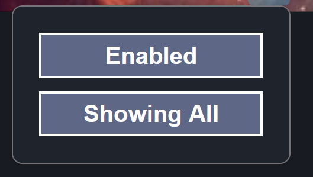

# Automatically Reveal Mastodon CW posts

This is an add-on that reveals all mastodon tweets hidden by content warnings. This is the menu:

You can toggle the first button to enable/disable the extension, and you can toggle the second to show/hide all Mastodon posts hidden by a content warning.

## Known Issues: 
- Toggling to Disabled if you previously Enabled it is sometimes buggy, as the code will act as if its enabled in certain areas. 
- if you toggle to Disabled, then you reveal some CW posts, then you toggle to Enabled, and toggle to "Hide All", the posts you revealed won't be recognized by the extension and will be left revealed. This is because Mastodon keeps removing my "show-cw-addon" class. 
- Most issues can be avoided if you reload the page everyime you toggle to Disabled.

## Technical Information
Mastodon posts all have the class "status__content__text". Those hidden by a Content Warning don't have the class "status__content__text--visible".

This add-on applies "status__content__text--visible" to all with class "status__content__text" without "status__content__text--visible". It adds the class "show-cw-addon" to these elements so when they need to be hidden, they can be found by their class.
